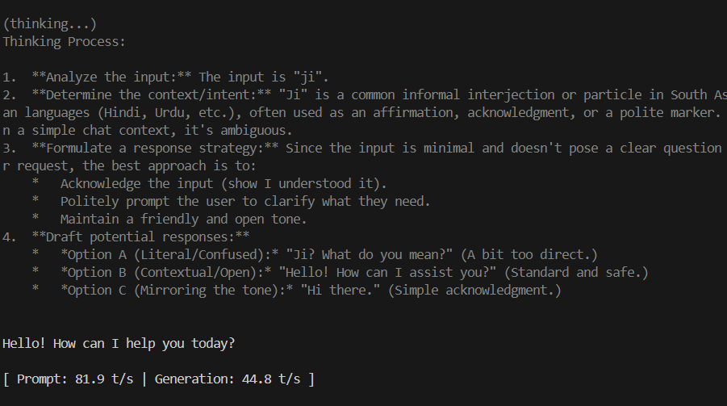

i need to immplement the terminal logo design and also wish to include the custom progress bar.

analyze the entire codebase and check any memory leaks or others.

i think the wrapper.go support for a particular models not all other gguf models

i think as of right now this only support vulkan and not cuda can you make it both support that and implement auto detection and set it if nividia detect set to cuda and also add an option to manually change to cuda or vulkan and also for offloading to cpu,gpu

still not fix the thinking collapse issue

some amount of delay for the > thing to first load up make it load along with the 

    ██████╗  ██╗      ██╗      █████╗ ███╗   ███╗ █████╗
   ██╔════╝  ██║      ██║     ██╔══██╗████╗ ████║██╔══██╗
   ██║  ███╗ ██║      ██║     ███████║██╔████╔██║███████║
   ██║   ██║ ██║      ██║     ██╔══██║██║╚██╔╝██║██╔══██║
   ╚██████╔╝ ███████╗ ███████╗██║  ██║██║ ╚═╝ ██║██║  ██║
    ╚═════╝  ╚══════╝ ╚══════╝╚═╝  ╚═╝╚═╝     ╚═╝╚═╝  ╚═╝

   ──────────────────────────────────────────────────────────

   Go-first bindings for llama.cpp • v1.0.0

   model    : gemma-4-E2B-it-Q4_K_M.gguf

   available commands:
     /exit or Ctrl+C    stop or exit
     /regen             regenerate the last response
     /clear             clear the chat history

   gllama commands:
     pull <repo>        download models from hugging face
     list               list your local models
     rm <model>         remove a downloaded model
     ps                 list active models on server
     tq <mode>          run with turboquant (lite, q8, q4)
     serve              start the gllama api server
     setup              re-run dependency setup

 gllama serve

    ██████╗  ██╗      ██╗      █████╗ ███╗   ███╗ █████╗ 
   ██╔════╝  ██║      ██║     ██╔══██╗████╗ ████║██╔══██╗
   ██║  ███╗ ██║      ██║     ███████║██╔████╔██║███████║
   ██║   ██║ ██║      ██║     ██╔══██║██║╚██╔╝██║██╔══██║
   ╚██████╔╝ ███████╗ ███████╗██║  ██║██║ ╚═╝ ██║██║  ██║
    ╚═════╝  ╚══════╝ ╚══════╝╚═╝  ╚═╝╚═╝     ╚═╝╚═╝  ╚═╝

   ──────────────────────────────────────────────────────────

   Go-first bindings for llama.cpp • v1.0.0

Starting Gllama Server...

not working
